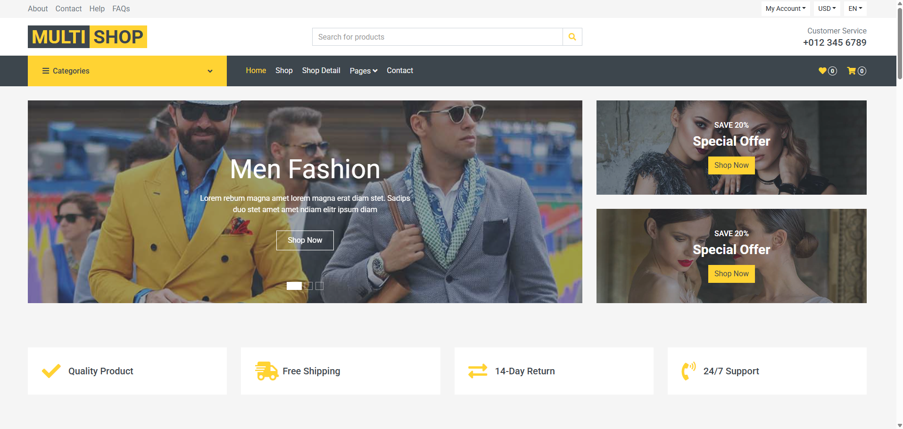
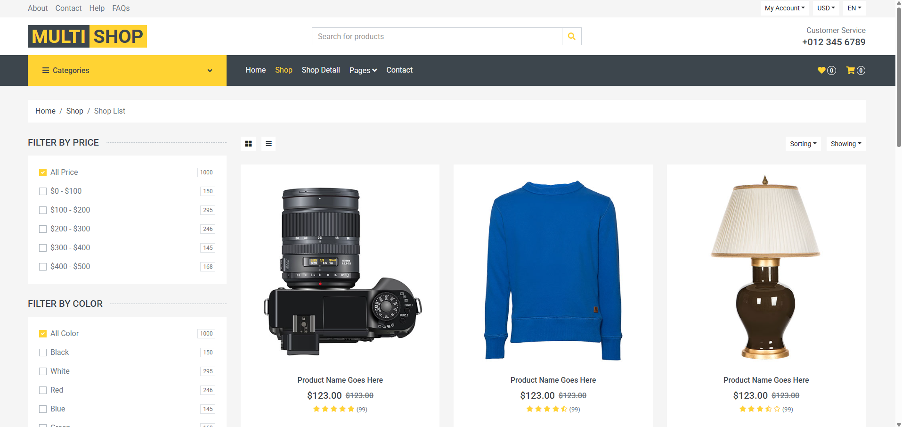
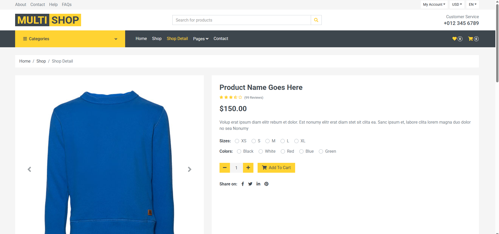
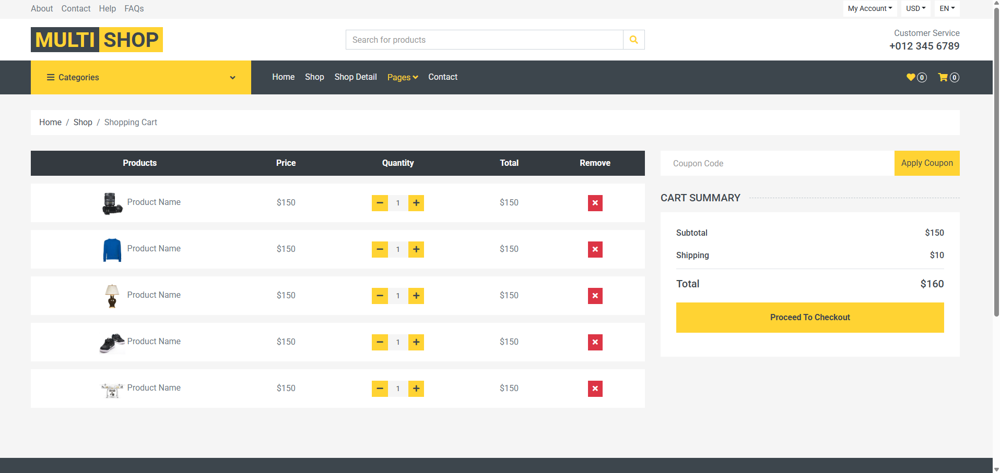
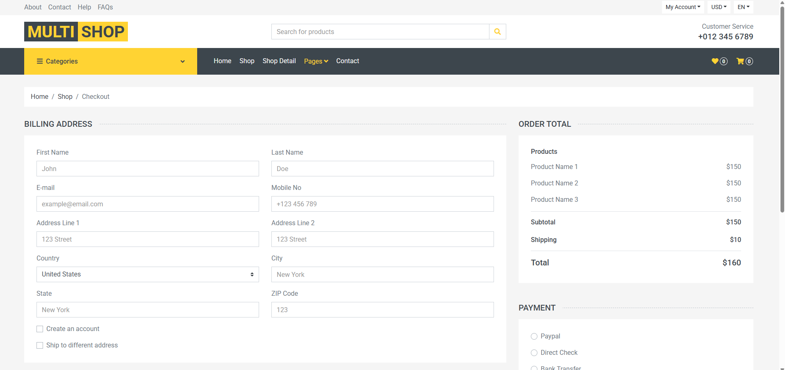
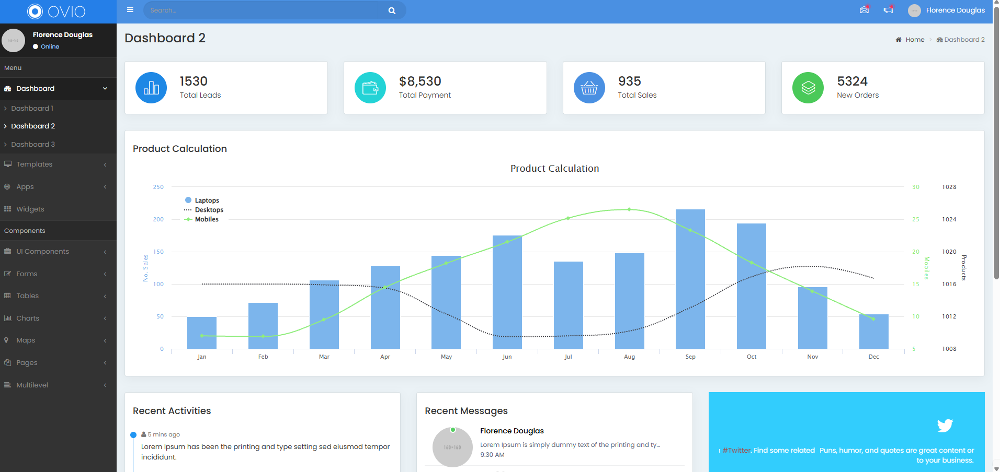
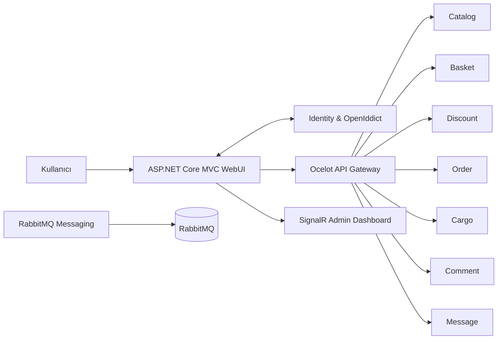

# MultiShop

MultiShop; ürün yönetimi, sepet, indirim, sipariş, kargo, yorum ve kullanıcı mesajlaşması gibi temel e-ticaret süreçlerini bağımsız servisler üzerinden yöneten, .NET 8 tabanlı bir mikroservis uygulamasıdır. Mağaza ve yönetim panellerini aynı sistemde buluştururken her servisin kendi iş alanına ve veri sorumluluğuna sahip olmasını amaçlar.

## Proje Görselleri

<p align="center">
  
  <br />
  <sub><b>Mağaza ana sayfası</b></sub>
</p>

<table>
  <tr>
    <td width="50%">
      
      <br />
      <sub><b>Ürün listesi</b></sub>
    </td>
    <td width="50%">
      
      <br />
      <sub><b>Ürün detay sayfası</b></sub>
    </td>
  </tr>
  <tr>
    <td width="50%">
      
      <br />
      <sub><b>Sepet ve kupon işlemleri</b></sub>
    </td>
    <td width="50%">
      
      <br />
      <sub><b>Sipariş ve ödeme ekranı</b></sub>
    </td>
  </tr>
  <tr>
    <td colspan="2">
      
      <br />
      <sub><b>Admin paneli tema görünümü</b></sub>
    </td>
  </tr>
</table>

## Öne Çıkan Üç Teknik Karar

- **Modern kimlik altyapısı:** Kullanıcı oturumları OpenIddict, Authorization Code + PKCE ve refresh token akışıyla; servis çağrıları ise kullanıcı token'ı veya client credentials token'ı ile yönetildi.
- **Servise uygun veri deposu:** Catalog için MongoDB, Basket için Redis, ilişkisel iş alanları için SQL Server ve Message servisi için PostgreSQL kullanılarak veri sahipliği servis sınırlarında tutuldu.
- **İhtiyaca göre iletişim modeli:** Merkezi yönlendirme için Ocelot, gerçek zamanlı yönetim istatistikleri için SignalR, dayanıklı asenkron mesajlaşma için RabbitMQ kullanıldı.

## Mimari Bakış



İstemci, servislerin adreslerini ayrı ayrı bilmek yerine WebUI ve API Gateway üzerinden sisteme erişir. Kimlik doğrulama Identity servisi tarafından gerçekleştirilir; servis çağrıları ise isteğin türüne göre kullanıcı access token'ı veya client credentials token'ı ile yapılır.

## Mikroservisler

| Servis | Sorumluluk | Veri/Altyapı |
|---|---|---|
| **Catalog** | Ürün, kategori, marka, ürün detayı, görseller ve vitrin içerikleri | MongoDB |
| **Basket** | Kullanıcı sepeti ve sepet yaşam süresi | Redis |
| **Discount** | İndirim kuponları ve kupon doğrulama | Dapper / SQL Server |
| **Order** | Adres, sipariş ve sipariş detayları | EF Core / SQL Server |
| **Cargo** | Kargo şirketi, müşteri ve operasyon yönetimi | EF Core / SQL Server |
| **Comment** | Ürün yorumları ve moderasyon işlemleri | EF Core / SQL Server |
| **Message** | Kullanıcılar arası gelen ve gönderilen mesajlar | EF Core / PostgreSQL |
| **Identity** | Kullanıcı, rol, oturum ve OAuth 2.0 / OpenID Connect akışları | ASP.NET Core Identity, OpenIddict, SQL Server |
| **RabbitMQ Messaging** | Asenkron mesaj üretme ve tüketme örneği | RabbitMQ |
| **WebUI** | Mağaza, kullanıcı ve yönetim arayüzleri | ASP.NET Core MVC, Razor, SignalR |
| **API Gateway** | Servis yönlendirme ve merkezi erişim noktası | Ocelot |

## Öne Çıkan Özellikler

- Ürün, kategori, marka ve vitrin içeriklerinin yönetimi
- Kategoriye göre ürün filtreleme ve ürün detay sayfaları
- Redis üzerinde kullanıcıya özel sepet yönetimi
- Sepete indirim kuponu uygulama
- Sipariş adresi ve sipariş geçmişi akışları
- Ürün yorumu oluşturma, onaylama ve silme
- Kullanıcılar arası gelen/gönderilen mesaj yönetimi
- Kargo şirketi ve kargo müşteri yönetimi
- Admin ve Manager rollerine özel yönetim ekranları
- Birden fazla servisten gelen verilerle oluşturulan admin istatistik paneli
- SignalR ile sayfa yenilenmeden güncellenen yönetim istatistikleri
- Türkçe ve İngilizce arayüz desteği
- Identity e-posta akışı ve yerel SMTP test ortamı
- RabbitMQ üzerinde durable queue, manual acknowledgement ve dead-letter queue yaklaşımı

## Kimlik Doğrulama ve Yetkilendirme

Projede kimlik altyapısı **ASP.NET Core Identity ve OpenIddict** ile kuruldu.

- Kullanıcı girişlerinde Authorization Code + PKCE akışı
- WebUI tarafında güvenli, HttpOnly cookie oturumu
- Access token süresi dolduğunda server-side refresh token yenilemesi
- Kullanıcı adına yapılan çağrılarda access token forwarding
- Kullanıcı bağlamı gerektirmeyen Catalog çağrılarında client credentials
- API seviyesinde issuer, audience, scope, role ve policy kontrolleri
- Admin/Manager işlemleri için rol tabanlı yetkilendirme
- Token ve secret değerlerinin istemci tarafına taşınmaması

Bu yapı sayesinde authentication yalnızca giriş yapmayı, authorization ise kullanıcının hangi işlemleri gerçekleştirebileceğini belirleyen ayrı sorumluluklar olarak ele alındı.

## Modernizasyon Yaklaşımı

Eğitimdeki mimari hedefleri koruyarak projeyi güncel geliştirme pratikleriyle yeniden ele aldım:

- Tüm projeler .NET 8 hedef framework'üne taşındı.
- Paket sürümleri `Directory.Packages.props` üzerinden merkezi olarak yönetildi.
- IdentityServer tabanlı eski akış yerine OpenIddict ve modern OIDC akışları kullanıldı.
- Connection string, client secret ve SMTP bilgileri kaynak koddan çıkarılarak user-secrets/environment üzerinden yönetildi.
- Typed `HttpClient`, validated options ve amaca göre ayrılmış token handler'ları kullanıldı.
- API'lerde DTO, validation, cancellation token ve sunucuya ait alan sınırları güçlendirildi.
- Kullanıcıya ait verilerde URL/form üzerinden gelen kullanıcı kimliğine güvenmek yerine token içindeki `sub` claim'i esas alındı.
- Ürün detayı ve değişken sayıdaki ürün görselleri, ürün aggregate'i içinde embedded olarak modellendi.
- Docker servisleri localhost port sınırı, named volume ve health check yaklaşımıyla düzenlendi.
- SignalR bağlantısına authorization, reconnect ve hata yönetimi eklendi.
- RabbitMQ akışında publisher confirm, durable topology, manual acknowledgement ve dead-letter queue kullanıldı.
- SMTP gönderimi Identity'nin `IEmailSender` sözleşmesine bağlandı; geliştirme ortamında Mailpit kullanıldı.

## Kullanılan Teknolojiler

- .NET 8 ve ASP.NET Core
- ASP.NET Core MVC ve Razor
- ASP.NET Core Identity
- OpenIddict
- Ocelot API Gateway
- Entity Framework Core
- MediatR ve CQRS
- Dapper
- MongoDB
- Microsoft SQL Server
- PostgreSQL
- Redis
- RabbitMQ
- SignalR
- AutoMapper
- MailKit ve Mailpit
- Docker ve Docker Compose

## Proje Yapısı

```text
MultiShop
├── ApiGateway
│   └── MultiShop.OcelotGateway
├── Frontends
│   └── MultiShop.WebUI
├── docs
│   └── images
├── Services
│   ├── Basket
│   ├── Cargo
│   ├── Catalog
│   ├── Comment
│   ├── Discount
│   ├── Identity
│   ├── Message
│   ├── Order
│   └── RabbitMQ
├── compose.yaml
├── compose.comment.yaml
├── compose.mailpit.yaml
├── compose.message.yaml
├── compose.rabbitmq.yaml
├── Directory.Packages.props
└── MultiShop.sln
```

## Yerel Ortam ve Yapılandırma

Projeyi derlemek için .NET 8 SDK gereklidir:

```bash
dotnet restore MultiShop.sln
dotnet build MultiShop.sln
```

SQL Server, PostgreSQL, Redis, RabbitMQ ve Mailpit gibi altyapı bileşenleri Docker Compose dosyalarıyla çalıştırılabilir. Bağlantı bilgileri, OpenIddict client secret'ları, SMTP ayarları ve benzeri hassas değerler repoda tutulmaz; ilgili projelerin user-secrets alanından veya environment variable üzerinden sağlanır.

Servisler farklı veri depolarına ve kimlik kapsamlarına sahip olduğu için uygulamayı çalıştırmadan önce ilgili servislerin local configuration değerlerinin hazırlanması gerekir.

## Bu Projede Kazandıklarım

Bu çalışma ile yalnızca mikroservisleri ayrı projelere bölmeyi değil;

- servis sınırlarını ve veri sahipliğini belirlemeyi,
- OAuth 2.0 / OpenID Connect akışlarını uygulamayı,
- kullanıcı token'ı ile servis token'ını ayırmayı,
- API Gateway üzerinden güvenli servis iletişimi kurmayı,
- senkron, gerçek zamanlı ve asenkron iletişim yöntemlerini doğru ihtiyaçlarda kullanmayı,
- farklı veri tabanı teknolojilerini aynı sistem içinde yönetmeyi,
- secret yönetimi, validation ve yetkilendirme gibi güvenlik kararlarını uygulamayı

deneyimledim.

## Projenin Kaynağı ve Kişisel Katkılarım

Bu proje, **Murat Yücedağ eğitmenliğinde M&Y Eğitim Akademi bünyesinde düzenlenen Full Stack .NET Bootcamp 10. Dönemi'nin 16. projesi** olarak geliştirilmiştir.

Projenin temel referansı Murat Yücedağ'ın [ASP.NET Core MultiShop Mikroservis E-Ticaret Kursu](https://www.udemy.com/course/aspnet-core-multishop-mikroservis-e-ticaret-kursu/)'dur. Eğitimde aktarılan mikroservis yaklaşımını ve temel iş akışlarını korurken projeyi kendi öğrenme hedeflerim doğrultusunda güncel .NET ekosistemine uyarladım. .NET 8 geçişi, OpenIddict tabanlı kimlik altyapısı, güvenlik sınırları, servis iletişimi, veri modelleme tercihleri ve dayanıklı mesajlaşma yaklaşımı bu kişisel uyarlamanın öne çıkan parçalarıdır.

## Teşekkür

Projenin temel mimarisini ve mikroservis yaklaşımını aktaran **Murat Yücedağ'a** ve bu çalışma ortamını sağlayan **M&Y Eğitim Akademi'ye** teşekkür ederim.
